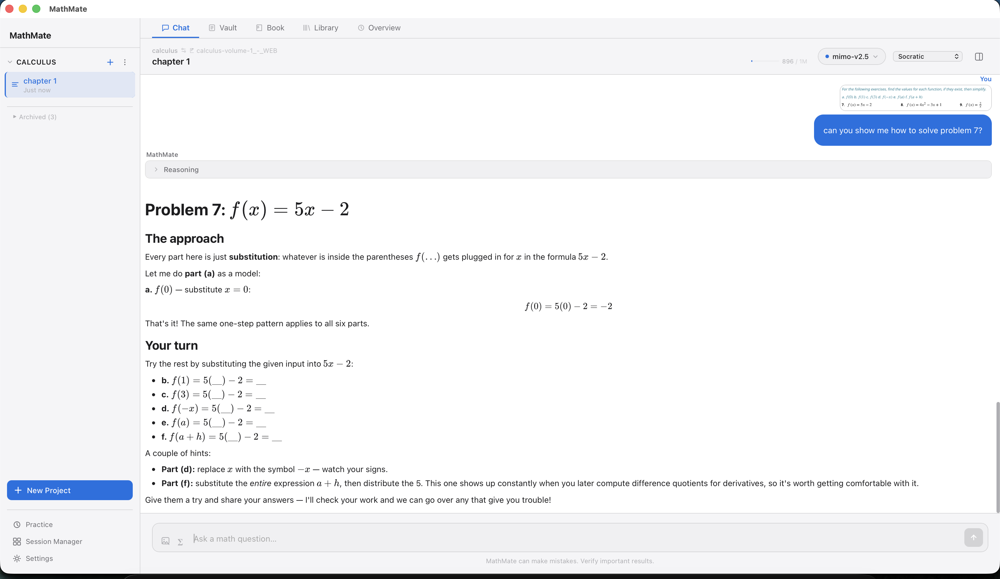
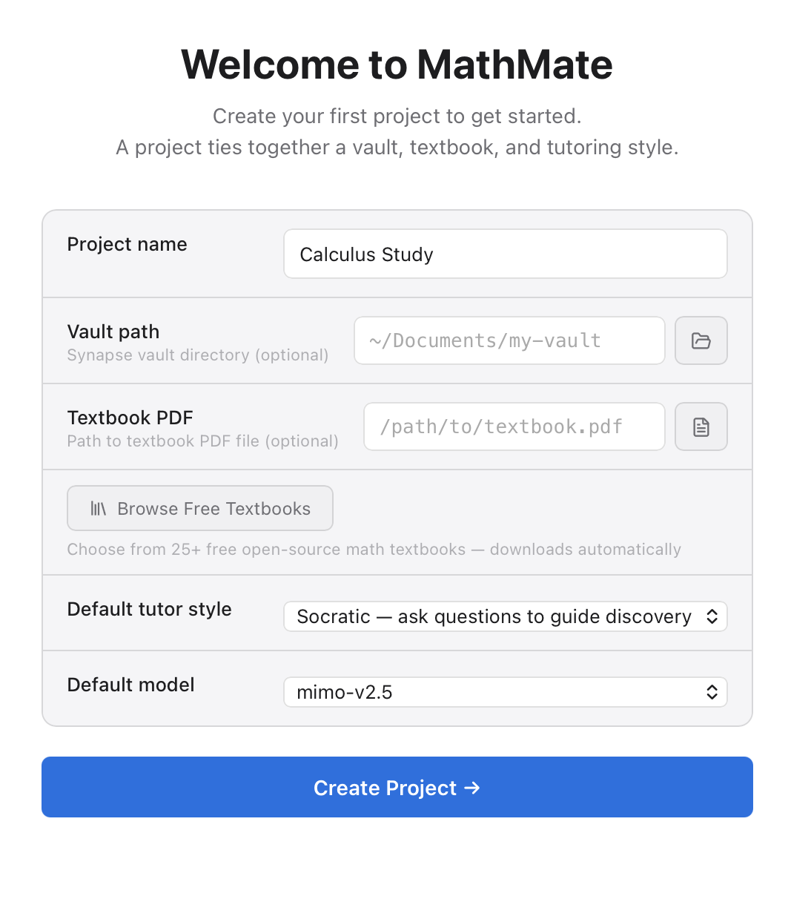
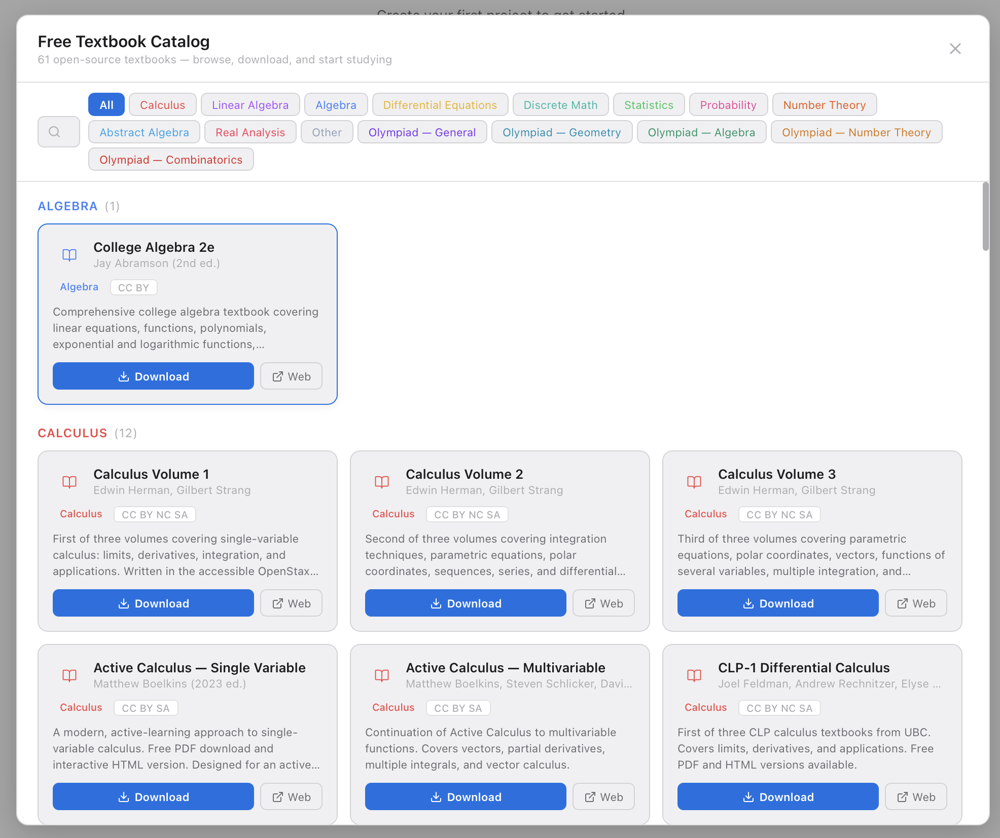

# MathMate

A desktop AI math tutoring app built with Tauri v2, React, and Rust. MathMate combines streaming AI responses, visible reasoning traces, KaTeX math rendering, Obsidian-style vault workflows, and a native desktop experience.



| New project | Free textbook catalog |
|---|---|
|  |  |

The chat is set to the Socratic tutor style: it works part (a) of the exercise as a model and leaves the remaining parts, with hints, for the student.

## Features

- **Streaming AI chat** with visible reasoning traces (kept as plain text, separate from rendered math)
- **KaTeX math rendering** — inline and block LaTeX, with normalization for model-specific formatting quirks
- **Multi-provider support** — OpenRouter (default), Anthropic, OpenAI; bring your own keys
- **Project & session management** — hierarchical organization with session branching and history
- **Obsidian-style vaults** — link one or more note vaults; the agent reads your notes for context-aware tutoring
- **Tool-calling agent** — multi-round tool loops (capped at 3 rounds) with path-scoped filesystem access
- **Interactive visualizations** — intent compiler (natural language → widget spec), annotation/tracer system, 3D surface primitives via Plotly
- **PDF viewer & textbook library** — in-app PDF reading with region selection; a built-in catalog of free, open-access math textbooks
- **Persistent memory** — SQLite-backed memory store with injection-safe retrieval and prompt isolation
- **Native macOS integration** — native menu, window, and keyboard shortcut support via Tauri

## Pedagogical Foundation

MathMate's design is informed by pedagogical research on AI in education. The central finding from 2024–2026 studies is that **unguarded AI access degrades learning**: students complete tasks faster but perform worse without the tool, and they don't perceive the decline ([Bastani et al., 2025](https://www.pnas.org/doi/10.1073/pnas.2422633122); [Lehmann et al., 2024](https://arxiv.org/abs/2409.09047)). The difference between harmful and helpful AI tutoring is entirely in **design** — guardrails that scaffold rather than substitute.

**Key design principles the research validates:**

- **Hints, not answers** — The hint ladder (escalating hints with an attempt-first gate) matches the guardrails that "largely mitigated" the harm from unguarded GPT-4 access in [Bastani et al. (2025)](https://www.pnas.org/doi/10.1073/pnas.2422633122). For low-efficacy students, tutors should guide toward errors rather than correcting them directly ([Kakarla et al., 2024](https://arxiv.org/abs/2401.03238)).
- **Visible reasoning traces** — Making the AI's process transparent supports the "complement" mode (explaining) over the "substitution" mode (generating solutions) ([Lehmann et al., 2024](https://arxiv.org/abs/2409.09047)).
- **Productive struggle** — Reducing cognitive load can be counterproductive if it removes the effort that produces learning ([Stadler et al., 2024](https://scale.stanford.edu/sites/default/files/The%20Evidence%20Base%20on%20AI%20in%20K-12%20Report.pdf); [Yu et al., 2026](https://arxiv.org/abs/2605.23177)). The "speedup illusion" — feeling more productive while learning less — is invisible to students.
- **Design is the differentiator** — When AI tutoring is meticulously designed around pedagogy, it can outperform in-class active learning in a randomized trial ([Kestin et al., 2025](https://www.nature.com/articles/s41598-025-97652-6)). The bar is high but achievable.

The critical risk the research identifies is the **crutch effect**: students default to using AI as a substitution tool (copying answers) rather than a complement (asking for explanations). MathMate's hint ladder, attempt-first gate, visible reasoning, and local memory are designed to make substitution structurally difficult and complement easy. See the [roadmap](docs/mathmate/00_Project_Management/Roadmap.md) for ongoing work to harden against this risk.

## Agent architecture and safety

The chat turn is an explicit, testable orchestrator rather than logic inside a UI store.

- **Turn orchestrator** (`mathmate/src/lib/turn/orchestrator.ts`): streams a model response, runs requested tools, feeds results back, and repeats for at most 3 tool rounds. Each tool call has an 8 s timeout, streamed output is capped at 1 MB per accumulated string, and the abort signal is honoured between steps. All I/O is injected, so the loop is tested in isolation with mocks (unit plus end-to-end tests).
- **Tools** (`mathmate/src-tauri/src/tools/`): calculate, current date, graph, textbook search, and vault list / read / search / write. Vault access goes through a path-scope guard that canonicalizes paths to block `..` traversal and symlink escapes (`pathscope.rs`).
- **Memory isolation** (`mathmate/src/lib/memorySafety.ts`, Rust `memory.rs`): memory writes are scanned for injection and exfiltration patterns (reject or redact), and retrieved memories are wrapped in a delimited, size-capped context block with low-trust items demoted, so stored text cannot act as instructions.
- **Audit log:** security events are written to `~/.mathmate/audit.log` with rotation at 1 MB.

## Tech Stack

| Layer | Technology |
|-------|-----------|
| Desktop shell | Tauri v2 |
| Frontend | React 19, TypeScript, Vite, Zustand |
| Backend | Rust (axum, rusqlite, reqwest) |
| Math rendering | KaTeX via marked-katex-extension |
| Markdown | marked + DOMPurify sanitizer |
| PDF | pdf.js (pdfjs-dist) |
| Visualization | Plotly |
| Tests | Vitest (frontend), `cargo test` (Rust) |

## Prerequisites

- [Node.js](https://nodejs.org/) 20+
- [Rust](https://www.rust-lang.org/tools/install) (stable)
- [Tauri v2 prerequisites](https://v2.tauri.app/start/prerequisites/) (system dependencies for your OS)

## Getting Started

```bash
cd mathmate
npm install
npm run tauri dev
```

This launches the Vite dev server and the Tauri desktop app in development mode.

### API Keys

MathMate needs at least one provider API key. Set via environment variables:

```bash
cp mathmate/.env.example mathmate/.env
# Edit .env with your keys:
# OPENROUTER_API_KEY=...
# ANTHROPIC_API_KEY=...
# OPENAI_API_KEY=...
```

Or configure providers in `~/.mathmate/models.json` (created on first run; see `mathmate/.env.example` for the key names). OpenRouter is the default provider path.

## Build & Test

All commands run from `mathmate/` unless noted.

```bash
npm run dev          # Frontend dev server only
npm run tauri dev    # Full desktop app (frontend + Rust)
npm run build        # TypeScript + Vite production build
npm run test         # Frontend unit tests (Vitest)
```

Rust checks (from `mathmate/src-tauri/`):

```bash
cargo check
cargo test
```

## Project Structure

```
mathmate/
├── mathmate/          # Active app (Tauri v2 + React + Rust)
│   ├── src/              # Frontend (React/TypeScript)
│   ├── src-tauri/        # Backend (Rust, Tauri commands)
│   └── package.json
├── docs/                 # Design docs, roadmap, changelog, dev logs
├── AGENTS.md             # Guide for AI contributors
├── CONTRIBUTING.md       # Guide for human contributors
└── LICENSE
```

See [`docs/mathmate/`](docs/mathmate/) for the roadmap, design specs, changelog, and development logs.

## Contributing

See [CONTRIBUTING.md](CONTRIBUTING.md). AI contributors should also read [AGENTS.md](AGENTS.md).

## License

[MIT](LICENSE) — © 2026 Steven Pequeno
